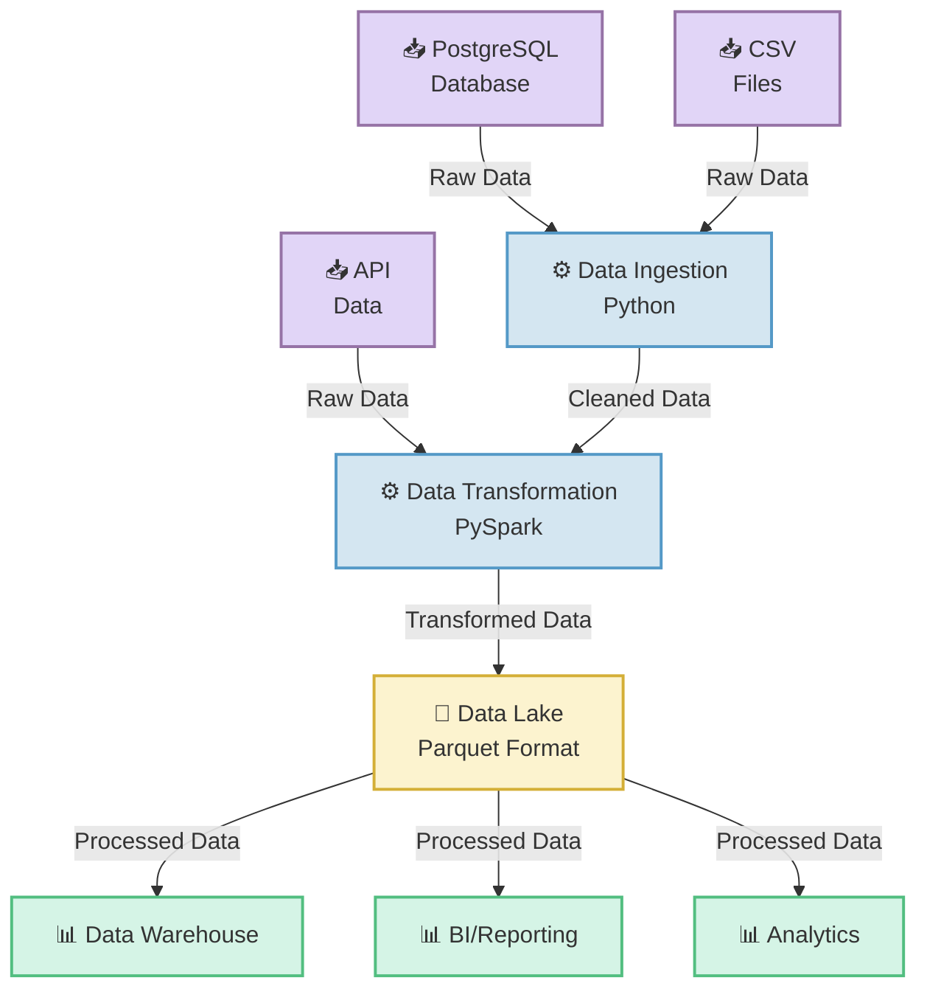

# Data Pipeline Dataflow Diagram

## Legend

| Component | Color | Description |
|-----------|-------|-------------|
| 📥 **Data Sources** | Purple | Raw data inputs (DB, files, APIs) |
| ⚙️ **Processing** | Blue | Data processing/transformation logic |
| 💾 **Storage** | Gold | Intermediate data storage |
| 📊 **Output** | Green | Final data destinations |

## Data Flow Steps

1. **Ingestion** → PostgreSQL, CSV, and API data are collected
2. **Processing** → Python cleans the data, PySpark transforms it
3. **Storage** → Transformed data lands in Data Lake (Parquet)
4. **Distribution** → Data flows to Warehouse, BI tools, and Analytics
